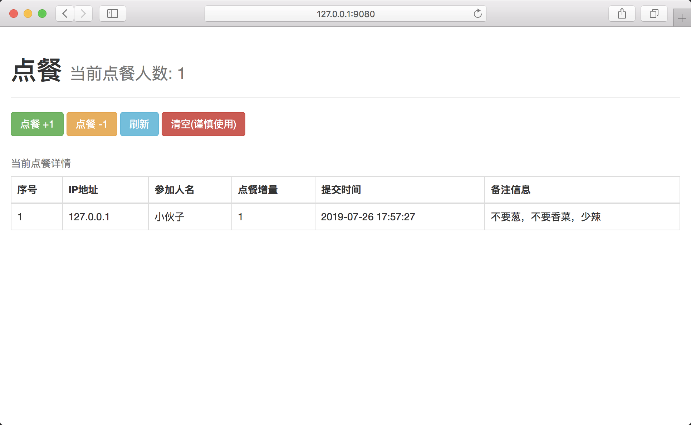

# Order Lunch APP
合伙点餐计数程序

## 示意图(abc)



## 项目结构

### 源代码结构
```
|- order-lunch-web
    |- asserts                  readme引用资源目录
    |- src                      项目源码
        |- main                 
            |- bin              脚本目录
            |- java             java源代码目录
            |- resources        资源目录
                |- static       前端资源目录
        |- test                 单元测试
    |- assembly.xml             构建打包描述文件
    |- pom.xml                  项目maven配置文件
    |- README.md                readme文档
```

### 部署后目录结构
```
|- order-lunch
    |- bin      可执行脚本目录
    |- conf     项目运行配置文件目录
    |- lib      项目依赖目录
    |- static   前端静态文件目录
```

## 构建运行步骤

### 克隆项目至本地
```
git clone 'xxxxxx'
```

### 构建项目源码
```
cd order-lunch-web

mvn clean package -Dmaven.test.skip=true
```

### 上传至环境
```
scp target/order-lunch.tar.gz root@xxx.xxx.xxx.xxx/home/temp
```

### 解压缩包
```
cd home/temp

tar -xzf order-lunch.tar.gz
```

### 启动项目
```
cd order-lunch

bin/order-lunch.sh start
```
